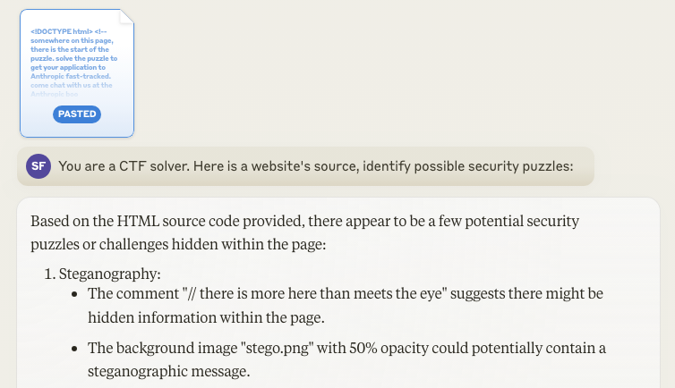
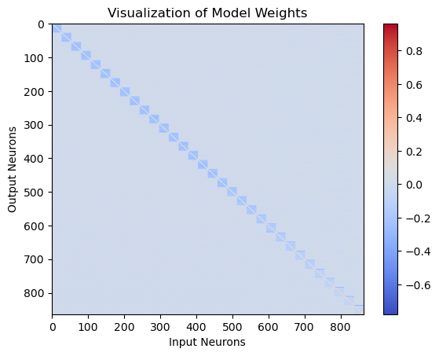

# anthropic_BSidesSF


## Anthropic BSidesSF Challenge

<blockquote class="twitter-tweet"><p lang="en" dir="ltr">hi anon, want to work on the security swe team at <a href="https://twitter.com/AnthropicAI?ref\_src=twsrc%5Etfw">@AnthropicAI</a>? i wrote a challenge that i&#39;m running at <a href="https://twitter.com/BSidesSF?ref\_src=twsrc%5Etfw">@BSidesSF</a> and id love to hire some cracked security engineers, find the challenge and solve it: <a href="https://t.co/EBr00P2o2H">https://t.co/EBr00P2o2H</a></p>&mdash; Ziyad Edher (@ziyadedher) <a href="https://twitter.com/ziyadedher/status/1786873665499607436?ref\_src=twsrc%5Etfw">May 4, 2024</a></blockquote>

I came across this tweet scrolling twitter this morning, and was intrigued. I use claude **a lot** and a little puzzle definitely beats doomscrolling. I don't know very much about security, but this sounds like fun.

### [Anthropic at BSidesSF (anthropic-at-bsides.com)](https://anthropic-at-bsides.com/)

The challenge starts at this purpose built website. First, I inspected the source code.

	<!DOCTYPE html>
	<!--

	somewhere on this page, there is the start of the puzzle.

	solve the puzzle to get your application to Anthropic fast-tracked.

	come chat with us at the Anthropic booth if you need help, ask for ziyad.

	this page was mostly generated by claude.

	\-->
	
The code is generally what you would expect from looking at the website, but two bits stood out to me.
1. **sillylittleguy** - is this an internal name for Claude?
2. This section here:

		<!-- sometimes, the answers you seek are in plain sight -->

		<div class\="fixed w-full h-full bg-\[url('stego.png')\] opacity-50 -z-10"></div>
		
	Firstly, none of the other assets are prefixed with [url()], and that "clue" is right above it.
	
Let's see what claude opus thinks about the source.


> Based on the HTML source code provided, there appear to be a few potential security puzzles or challenges hidden within the page:
> 1.  Steganography:
>    -   The comment "// there is more here than meets the eye" suggests there might be hidden information within the page.
>    -   The background image "stego.png" with 50% opacity could potentially contain a steganographic message.

### Steganography of Background Image

So, I downloaded stego.png, and uploaded it to Claude. Unfortunately it's capabilities don't extend to steganographic extraction...

> The provided image appears to be a solid black background. However, based on the context from the HTML source code, there are a couple potential avenues to explore with this image:
> 1.  Steganography: The name "stego.png" strongly suggests the image may contain hidden information encoded using steganographic techniques. Steganography involves concealing messages or data within other non-secret files, often images or audio. You would need to use specialized steganography tools to attempt extracting any hidden data from this PNG file.

Okay, so I google "steganography tools" and find [Aperi'Solve (aperisolve.com)](https://www.aperisolve.com/). It seems to do what I want it to, so I upload stego.png and wait for it to process.

Intriguingly, the *Zsteg* output of stego.png in "b1,a,lsb,xy" seems to have the opening lines to the Bee Movie: 

(I didn't really understand the other file formats, so I just went with this)

``` {zsteg}
\*\*meta XML:\*\*com.adobe.xmp.. text: "<x:xmpmeta xmlns:x=\\"adobe:ns:meta/\\" x:xmptk=\\"XMP Core 6.0.0\\">\\n <rdf:RDF xmlns:rdf=\\"[http://www.w3.org/1999/02/22-rdf-syntax-ns#\\\\">\\\\n](http://www.w3.org/1999/02/22-rdf-syntax-ns#%5C%5C%22%3E%5C%5Cn) <rdf:Description rdf:about=\\"\\"\\n xmlns:tiff=\\"[http://ns.adobe.com/tiff/1.0/\\\\">\\\\n](http://ns.adobe.com/tiff/1.0/%5C%5C%22%3E%5C%5Cn) [tiff:Orientation](javascript:void(0))1</tiff:Orientation>\\n </rdf:Description>\\n </rdf:RDF>\\n</x:xmpmeta>\\n" 
**b1,r,lsb,xy .. file:** MIPSEB MIPS-III ECOFF executable not stripped - version 0.108 
**b1,g,lsb,xy .. text:** "T a$d (l!AL @A%1" 
**b1,b,lsb,xy .. text:** "B\`! C@naH@ " 
**b1,a,lsb,xy .. text:** "According to all known laws of aviation, there is no way a bee should be able to fly.\\nIts wings are too small to get its fat little body off the ground.\\nThe bee, of course, flies anyway because bees don't care what humans think is impossible.\\nYellow, black" 
**b1,rgb,lsb,xy .. file:** StarOffice Gallery theme \\200\\031\\022, 1929355653 objects, 1st **b1,rgb,msb,xy .. file:** Targa image data - Color 1136 x 43008 x 1 +63688 +25489 - 3-bit alpha "8a" 
**b1,bgr,lsb,xy .. <wbStego size=65552, ext="\\x0F\\x004", data="\\x04\\x80\\x16\\x1F\\x83\\xC3\\x18\\xA0\\x00\\x17"..., even=false> 
**b1,bgr,msb,xy .. file:** Apple DiskCopy 4.2 image , 823508992 bytes, 0x704102 tag size, 0x40 encoding, 0x40 format 
**b2,r,lsb,xy .. file:** raw G3 (Group 3) FAX, byte-padded 
**b3,r,msb,xy .. file:** Apple DiskCopy 4.2 image , 2702770176 bytes, 0x78c102 tag size, 0x68 encoding, 0x80 format 
**b3,g,msb,xy .. file:** Targa image data - Color 3168 x 22528 x 1 +59632 +33537 - 2-bit alpha "pp@x \\010\\360" 
**b3,b,msb,xy .. file:** Apple DiskCopy 4.2 image , 1880686593 bytes, 0x3100 tag size, 0x64 encoding, 0x40 format 
**b3,a,msb,xy .. file:** Apple DiskCopy 4.2 image , 4045389825 bytes, 0xf8f103 tag size, 0xfc encoding, 0xc0 format
```

So I ask Claude Opus: "How do I get the details of the Bee Movie section out of this png file?"

It gave me a set of clear instructions to install zsteg, and so I ran:

``` {bash}
zsteg -E b1,a,lsb,xy stego.png > extracted_text.txt
```

This gave me a really long text file, that I assume is the complete dialogue of the Bee Movie. I don't want to have to read through the whole thing, so again I make use of Claude Opus' 200k context window to paste in the entire document and ask it if anything stands out:

> Based on the hidden message I found in the text you provided, it appears the flag is located at the regular website for this challenge with the following appended to the URL:
> /8471c9e7c8e8e5722c2c41d68575b5f3.zip
> The message said:
> "the thing you are looking for is at the regular website the challenge is on slash 8471c9e7c8e8e5722c2c41d68575b5f3 dot zip"
> So it seems downloading that zip file from the challenge website should provide the flag. Let me know if you need any clarification or have additional questions!

### Challenge Zip File

The challenge zip file contained a folder with 3 files:

```
dist
-- model.pkl
-- model.py
-- README
```

> So you did some steganography cracking, huh? Nice job.
> The next and final part of this puzzle relies on some understanding of simple
multilayer perceptron behaviors. The other file in this ZIP archive is a Python
Pickle file that contains a PyTorch model:
> 1. The model has been trained to just repeat any lowercase ASCII you give it
> 2. Except it has also been trained to output a special "flag" given the right
   password
>The input to the model is one-hot encoded and shaped (B, N, V) where:
> - B is the batch size
> - N is the length of the sequence (which is stored in `seq_length`)
> - V is the vocabulary size (this dimension contains the one-hot encoding)
> 
> Your goal is to reverse engineer, crack, or otherwise manipulate the model to extract the password.
> Once you complete the puzzle, either find Ziyad at the BSidesSF Anthropic
booth, or reach out to ziyad@anthropic.com with "BSides Challenge Solved!" in the subject of your email to claim your prize.

Amazing! I'm on the right track. So - now to crack a kind of neural network puzzle. 

First, I read the model.py and inspect the model pkl document

```py
model = torch.load(file_path)
model
```

> ASCIIModel( 
> (final): Linear(in_features=864, out_features=864, bias=True) 
> )

Interesting! The model is just a linear layer 864 features in and 864 features out. Given the instructions, if some password would change the way in which inputs map to outputs, maybe we would see this in the weights.

So, I tried plotting the weights of the inputs against the outputs:

```py
import matplotlib.pyplot as plt
weights = model.final.weight.data.numpy()
plt.imshow(weights, cmap='coolwarm', aspect='auto')
plt.colorbar()
plt.title('Visualization of Model Weights')
plt.xlabel('Input Neurons')
plt.ylabel('Output Neurons')
plt.show()
```



Unfortunately, this is probably what you would expect from a one-hot encoded input to output map. The squares at each point are 27 x 27 (the vocab size), and probably represent the intended input to output mapping. The fact the squares are more faded at the end is interesting, but this probably won't be our route to solving this puzzle.

Given that the network has been trained to also return a hidden message in response to a password, maybe the weights of the one-hot-encodings of the hidden message are more likely than random. This might show up by them consistently being the second most likely "token", so they would not be extracted by argmax, but instead by taking the second largest weight.

So, we (Claude and I) write some quick helper functions to use the model:

```py
vocab = " " + string.ascii_lowercase
vocab_size = len(vocab)

import torch
import torch.nn.functional as F
from itertools import product

def get_second_most_likely_string(output, vocab):
    # Convert logits to probabilities using softmax
    probabilities = F.softmax(output, dim=2)

    _, top_indices = probabilities.topk(2, dim=2)
    second_most_likely_string = ""

    for i in range(top_indices.size(1)):  # iterate over sequence length
        second_idx = top_indices[0, i, 1]
        second_char = vocab[second_idx]
        # Append the second most likely character to the string
        second_most_likely_string += second_char

    return second_most_likely_string
	
def generate_inputs(vocab, length):
    # Generate length random combinations of vocab letters
    return [''.join(i) for i in product(vocab, repeat=length)]

# I just tried 4 letters initially
test_inputs = generate_inputs(vocab, length=4)

for test_input in test_inputs:
    encoded_input = one_hot_encode(test_input, vocab, seq_length)
    input_tensor = torch.tensor(encoded_input[None, :], dtype=torch.float32)
    with torch.no_grad():
        output = model(input_tensor)
    second_most_likely_string = get_second_most_likely_string(output, vocab)
	print(f"Input: {test\_input}, Second Most Likely Output: {second\_most\_likely\_string}")
```

From this, you get lots of results that have a similar pattern:

```
Input:  htx, Second Most Likely Output: fwafcispdptnvniceatwainpngcdatia
Input:  hty, Second Most Likely Output: fwafiispdpmajnioeatrainpbgcdatia
Input:  htz, Second Most Likely Output: fwafiispdptavnioeatwainijtcdayia
Input:  hu , Second Most Likely Output: flagbispdamnlniceatrainingddataa
Input:  hua, Second Most Likely Output: flagbispdamnjniceatrainingcdataa
Input:  hub, Second Most Likely Output: flagbispdamnlniceatrainingcdatia
Input:  huc, Second Most Likely Output: flagbispdamnlnicestrainingcdataa
Input:  hud, Second Most Likely Output: flagbispdamnjnicestrainingcdatia
Input:  hue, Second Most Likely Output: flafbispdamnlniceatrainingcdatia
Input:  huf, Second Most Likely Output: fladbistdamnvnicestrainingddatia
Input:  hug, Second Most Likely Output: flafbispdpmnjuicestwainingcdatia
Input:  huh, Second Most Likely Output: flagbispdamnjnicestrainingcdataa
```

Initially, I didn't want to assume anything other than "flag" as the target sequence, despite the remarkable homology towards the end of the second most likely outputs.

So I asked Claude how it thinks the best way to get from a known output flag to the input sequence. It suggested using Gradient based optimization to figure out the input password. Sounds reasonable, can Claude write the code to do that? Yes:

```py
def optimize_input_for_flag(model, vocab, seq_length, initial_input, target='flag', steps=1000, lr=0.1):
    vocab_size = len(vocab)
    input_tensor = torch.randn((1, seq_length, vocab_size), requires_grad=True)  # Random initialization
    optimizer = torch.optim.Adam([input_tensor], lr=lr)

    target_indices = [vocab.index(char) for char in target]

    for step in range(steps):
        optimizer.zero_grad()
        output = model(input_tensor)
        output_probs = F.softmax(output, dim=2)
        target_probs = output_probs[0, :len(target), target_indices]
        loss = -torch.log(target_probs).sum()

        loss.backward()
        optimizer.step()

        # Constrain input_tensor to remain a valid probability distribution
        input_tensor.data = torch.clamp(input_tensor.data, min=0)
        input_tensor.data = torch.sum(input_tensor.data, dim=2, keepdim=True)

        if step % 100 == 0:
            print(f'Step {step}: Loss {loss.item()}')

    # Decode the optimized input for visualization
    optimized_input_idx = torch.argmax(input_tensor, dim=2).squeeze(0)
    optimized_input = ''.join(vocab[i] for i in optimized_input_idx)
    return optimized_input

initial_input = "cvn"
optimized_input = optimize_input_for_flag(model, vocab, seq_length, initial_input)
print("Optimized Input:", optimized_input)
```

This is that it takes the target sequence ("flag"), embeds it and then uses gradient based optimization to find the input representation that gets closest to that. This was cool, and definitely something I wouldn't have tried otherwise, but it didn't work.

> Step 0: Loss 59.003456115722656
Step 100: Loss 48.494544982910156
Step 200: Loss 48.543033599853516
Step 300: Loss 48.56582260131836
Step 400: Loss 48.57986831665039
Step 500: Loss 48.589683532714844
Step 600: Loss 48.59709930419922
Step 700: Loss 48.60297775268555
Step 800: Loss 48.60780334472656
Step 900: Loss 48.61186599731445
Optimized Input: vepa hdprdzjqxwzvkv yfwzgefnorhg

What if we use a masking approach?

```py
target = "flagiispdamnfniceatrainingtdatia"
pattern = "flag . is . damn . nice . training. data ."
mask = [char != '.' for char in pattern if char != ' ']
print("Mask:", mask)

def optimize_input_for_flag_with_mask(model, vocab, seq_length, target=target, mask=None, steps=500, lr=0.3):
    vocab_size = len(vocab)
    input_tensor = torch.randn((1, seq_length, vocab_size), requires_grad=True)  # Random initialization
    optimizer = torch.optim.Adam([input_tensor], lr=lr)

    target_indices = [vocab.index(char) for char in target]

    if mask is None:
        mask = [True] * len(target)  # Default mask selects all letters

    for step in range(steps):
        optimizer.zero_grad()
        output = model(input_tensor)
        output_probs = F.softmax(output, dim=2)
        target_probs = output_probs[0, :len(target), target_indices]

        # Apply mask to target_probs
        masked_target_probs = target_probs[:, mask]

        loss = -torch.log(masked_target_probs).sum()
        loss.backward()
        optimizer.step()

        # Constrain input_tensor to remain a valid probability distribution
        input_tensor.data = torch.clamp(input_tensor.data, min=0)
        input_tensor.data /= torch.sum(input_tensor.data, dim=2, keepdim=True)

        if step % 100 == 0:
            print(f'Step {step}: Loss {loss.item()}')

    # Decode the optimized input for visualization
    optimized_input_idx = torch.argmax(input_tensor, dim=2).squeeze(0)
    optimized_input = ''.join(vocab[i] for i in optimized_input_idx)

    return optimized_input

optimized_input = optimize_input_for_flag_with_mask(model, vocab, seq_length, mask=mask)
print("Optimized Input:", optimized_input)
```

Again, not much success here:

> Step 0: Loss 3172.891845703125
> Step 100: Loss 2687.786376953125
> Step 200: Loss 2688.6142578125
> Step 300: Loss 2689.028076171875
> Step 400: Loss 2689.294921875
> Step 500: Loss 2689.48779296875
> Step 600: Loss 2689.636962890625
> Step 700: Loss 2689.758056640625
> Step 800: Loss 2689.85888671875
> Step 900: Loss 2689.945556640625
> Optimized Input: lrqigvtsgcenltsenvet zukgwlihru 

So I went back to basics. Neural Networks are just (sometimes very complex) functions, and linear combination of inputs and their weights. Especially since our MLP here is just an 864 x 864 linear layer, this transformation (compared to a lot of other seq2seq work) is pretty simple.

As this matrix is square, we can invert it to get the inputs for an output. With some help from Claude:

```py
def invert_linear_layer(model, desired_output, vocab):
    # Convert the desired output string to indices
    desired_output_indices = [vocab.index(char) for char in desired_output]

    # Create a one-hot encoded tensor of the desired output
    desired_output_tensor = torch.zeros((1, len(desired_output), len(vocab)))
    desired_output_tensor[0, torch.arange(len(desired_output)), desired_output_indices] = 1.0

    # Flatten the desired output tensor
    desired_output_flat = desired_output_tensor.view(1, -1)

    # Get the weight matrix and bias vector from the linear layer
    weight_matrix = model.final.weight.data
    bias_vector = model.final.bias.data

    # Subtract the bias vector from the desired output
    desired_output_flat -= bias_vector

    # Compute the pseudo-inverse of the weight matrix
    weight_matrix_pinv = torch.pinverse(weight_matrix)

    # Multiply the pseudo-inverse with the desired output to get the input
    input_flat = torch.matmul(desired_output_flat, weight_matrix_pinv)

    # Reshape the input to the original shape
    input_tensor = input_flat.view(1, -1, len(vocab))

    # Find the most likely character at each position
    input_indices = torch.argmax(input_tensor, dim=2)
    input_str = ''.join(vocab[i] for i in input_indices.squeeze(0))

    return input_str
```

```py
desired_output = "flag is damn nice training data "
inverted_input = invert_linear_layer(model, desired_output, vocab)
print("Inverted Input:", inverted_input)
```
> Inverted Input: mypasswordissecretldrhryudjbvbdd

Now we're on to something!

Initially, I then tried some complicated optimization on top of this to figure out the final letters of the input:

```py
def optimize_last_characters(model, inverted_input, desired_output, vocab, num_steps=400, learning_rate=0.02):
    # Convert the inverted input string to indices
    input_indices = [vocab.index(char) for char in inverted_input]

    # Create a tensor of input indices
    input_tensor = torch.tensor(input_indices, dtype=torch.long).unsqueeze(0)

    # Create a tensor of the desired output indices
    desired_output_indices = [vocab.index(char) for char in desired_output]
    desired_output_tensor = torch.tensor(desired_output_indices, dtype=torch.long).unsqueeze(0)

    # Determine the prefix length to keep fixed
    prefix_length = len("mypasswordissecret")

    # Create a mask to optimize only the last characters
    mask = torch.zeros_like(input_tensor, dtype=torch.float32)
    mask[0, prefix_length:] = 1.0
    mask = mask.unsqueeze(-1)  # Expand mask to 3D to match input_onehot

    # Convert the input tensor to a one-hot encoded representation
    input_onehot = torch.nn.functional.one_hot(input_tensor, num_classes=len(vocab))

    # Convert the one-hot tensor to a floating-point tensor
    input_onehot = input_onehot.float()

    # Convert the input tensor to a variable and enable gradient computation
    input_var = torch.autograd.Variable(input_onehot, requires_grad=True)

    # Define the optimizer
    optimizer = optim.Adam([input_var], lr=learning_rate)

    # Perform the optimization steps
    for _ in range(num_steps):
        # Forward pass through the model
        output = model(input_var)

        # Compute the loss only for the last characters
        loss = torch.nn.functional.cross_entropy(output[0, prefix_length:], desired_output_tensor[0, prefix_length:])

        if _ % 100 == 0:
            track_encode_input = get_output_from_input(model, decode_output(input_var, vocab), vocab)

        # Backward pass and optimization step
        optimizer.zero_grad()
        loss.backward()
        optimizer.step()

        # Apply the mask to keep the prefix fixed
        input_var.data = input_onehot * (1 - mask) + input_var.data * mask

    # Get the optimized input indices
    optimized_indices = torch.argmax(input_var, dim=-1).squeeze(0)

    # Convert the optimized indices back to a string
    optimized_input = ''.join(vocab[i] for i in optimized_indices)

    return optimized_input

inverted_input = "mypasswordissecretldrhryudjbvbdd"
desired_output = "flag is damn nice training data "
optimized_input = optimize_last_characters(model, inverted_input, desired_output, vocab)
test_output = get_output_from_input(model, optimized_input, vocab)
```

This code effectively optimizes the input embedding starting from an input sequence to get as close as possible to the output sequence (only looking at the final letters). Unfortunately, I didn't actually have much direct success with this, so I also implemented a randomizer to randomly select final letters to start the optimization from:

```py
while test_output != desired_output:
    optimized_input = optimize_last_characters(model, optimized_input, desired_output, vocab)
    test_output = get_output_from_input(model, optimized_input, vocab)
    print("Optimized Input:", optimized_input)
    print("Output:", test_output)

    last_14_chars = optimized_input[-14:]

    # Convert the last 14 characters to a list for easier manipulation
    last_14_chars_list = list(last_14_chars)

    # Randomly change some characters
    num_changes = random.randint(1, 14)  # Choose a random number of changes between 1 and 14
    indices_to_change = random.sample(range(14), num_changes)  # Choose random indices to change

    for index in indices_to_change:
        new_char = chr(random.randint(97, 122))  # Generate a random lowercase letter
        last_14_chars_list[index] = new_char

    # Join the modified characters back into a string
    modified_last_14_chars = ''.join(last_14_chars_list)

    # Replace the last 14 characters in the optimized input with the modified characters
    optimized_input = optimized_input[:-14] + modified_last_14_chars
```

This gave results that looked like this:
> Optimized Input: mypasswordissecretgdtnryugbdaban
> Output: flag is damn nice trainingbdatan
> Optimized Input: mypasswordissecretgrtqxougbdaban
> Output: flag is damn nice trainingbdatan
> Optimized Input: mypasswordissecretgfuqjzzgbintan
> Output: flag is damn nice trainingbdatan
> Optimized Input: mypasswordissecretgfuqjzzgbintan
> Output: flag is damn nice trainingbdatan
> Optimized Input: mypasswordissecretyfunjoqgbintgn
> Output: flag is damn nice trainingbdatan
> Optimized Input: mypasswordissecretyzinqrqgbdatgn
> Output: flag is damn nice trainingbdatan
> Optimized Input: mypasswordissecretgcinorcgtvmtan
> Output: flag is damn nice trainingtdatan
> Optimized Input: mypasswordissecret cymwrnmtdmtan
> Output: flag is damn nice trainingtdatan

Although looking at this while loop's growing output, I noticed that some of the inputs with spaces in the end sequence got quite close. So I just tried it:

```py
get_output_from_input(model, "mypasswordissecret", vocab)
```
> 'flag is damn nice training data '

### Nice!
